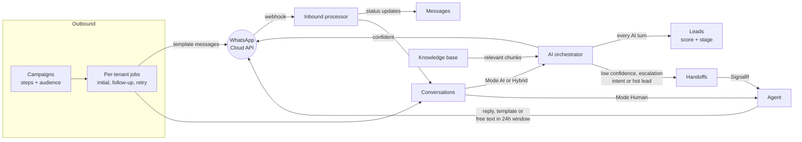

# Module flows — index

Flowcharts for the modules with real business logic behind them. Each chart lives next to its Angular
module so it's found where the code is. Every chart was traced from both repos' code, not from the design
docs; where the two differ, the code wins.

| Module | Charts | Covers |
| --- | --- | --- |
| Campaigns | [campaigns/FLOWS.md](../src/app/features/campaigns/FLOWS.md) | lifecycle, setup and start validation, send pipeline, retries, customer status |
| Conversations | [conversations/FLOWS.md](../src/app/features/conversations/FLOWS.md) | inbound webhook, AI orchestrator decision, agent send, conversation and message status, opt-out detection |
| Handoffs | [handoffs/FLOWS.md](../src/app/features/handoffs/FLOWS.md) | end-to-end sequence, escalation triggers, the briefing, claim and resolve |
| Leads | [leads/FLOWS.md](../src/app/features/leads/FLOWS.md) | AI scoring, stages, agent actions |
| Knowledge base | [knowledge-base/FLOWS.md](../src/app/features/knowledge-base/FLOWS.md) | publish and embed, per-model publishing, retrieval |

The charts are Mermaid. They render on GitHub and in VS Code with a Mermaid preview extension.

## How the modules connect

## Background jobs (per tenant)

| Job | Default schedule | Does |
| --- | --- | --- |
| Campaign initial sends | every minute | promotes due Scheduled campaigns, sends step 0 |
| Campaign follow-ups | every minute | sends the next step to customers whose delay has passed |
| Campaign send retries | every 5 minutes | retries failed or stuck sends with backoff |
| WhatsApp template sync | hourly | pushes templates to Meta, pulls review status |
| WhatsApp token refresh | daily | refreshes the tenant's Meta access token |
| Inbound webhook processing | on each webhook | one job per event, reschedules itself for status races |

A per-tenant job is skipped if the tenant no longer exists, its status doesn't allow background jobs, or
the job is disabled in the Platform Admin Console.

## Gaps found while tracing

These are behaviours the charts show as they are today. None are fixed by these docs.

1. **Campaigns never reach `Completed`.** Nothing sets it, so a finished campaign stays `Running`.
2. **Campaign replies don't stop follow-ups.** `Responded` and `HandedOff` customer statuses are never set;
   only an opt-out keyword stops the sequence.
3. **Escalated conversations stay Escalated.** Resolving a handoff doesn't return the conversation to
   `Open`, and the AI keeps replying unless the Mode is switched to `Human`.
4. **Unused statuses.** Handoff `InProgress` and article `Archived` are never set. Trigger reasons
   `KnowledgeGap` and `BusinessRule` are in the enum for tenant-configured escalation rules but
   nothing raises them yet; `ComplexTechnical` is no longer produced for new handoffs, only kept for
   ones raised before the support intents were consolidated.
