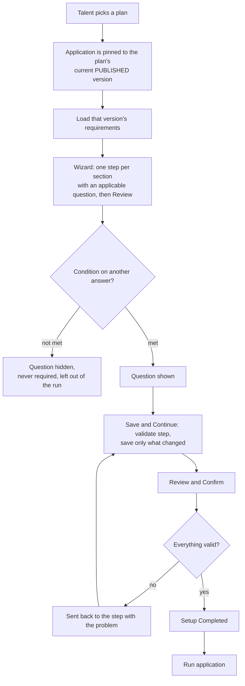
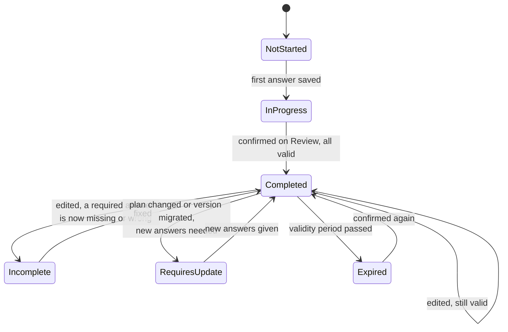
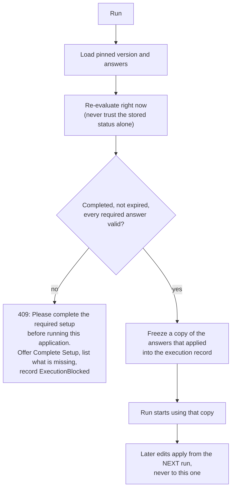
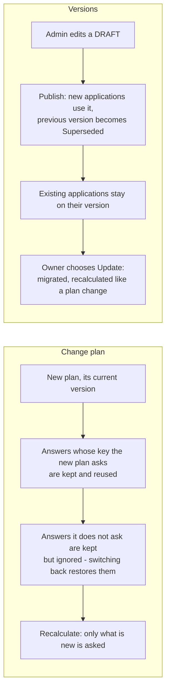

# Applications — flows

How a tenant sets up and runs an application on a plan, and how the plan decides what it is asked. All charts
are traced from the code. Index of every module's charts: [docs/MODULE-FLOWS.md](../../../../docs/MODULE-FLOWS.md).

The rule that shapes everything: **no question is written into the UI.** What a Talent is asked comes from the
plan's setup requirements (data), so a new plan, or a new question on an existing one, needs no release.

| Where the logic lives | File |
| --- | --- |
| Wizard (steps, progress, inline validation) | [setup-wizard.component.ts](../setup-shared/setup-wizard/setup-wizard.component.ts) |
| One question of any type | [setup-field.component.ts](../setup-shared/setup-field/setup-field.component.ts) |
| Client copy of visibility and validation rules | [setup-rules.ts](../../core/utils/setup-rules.ts) |
| Talent HTTP calls | [application.service.ts](../../core/services/application.service.ts) |
| Admin HTTP calls | [platform-setup.service.ts](../../core/services/platform-setup.service.ts) |
| Rules, authority (API) | `AI-Sales-Automation-System-api/.../Application/Setup/SetupEvaluator.cs` |
| Setup, plan change, execute (API) | `.../Application/Setup/ApplicationSetupService.cs` |
| Versions and requirements (API) | `.../Application/Setup/SetupAdminService.cs` |
| Out-of-the-box requirements (API) | `.../Infrastructure/Persistence/Seed/SetupRequirementSeeder.cs` |

---

## 1. From plan to running application

The wizard is built from the definition of the version the application is pinned to. Only sections that have
at least one applicable question become steps.

## 2. Setup status

The status is stored, but recomputed from the answers on every save - and again at execution, so a stale value
can never let an incomplete setup run.

A plan change or migration that needs nothing new leaves a completed setup completed.

## 3. Running an application

## 4. Plan change and versions

Answers are stored by field key, not by requirement, so they follow the application across plans and versions.

A published version is frozen. Changing it means starting a new draft (a copy), which is what keeps a running
application predictable and every past run explainable.

## 5. What is recorded

| Event | Recorded as |
| --- | --- |
| Application created | `ApplicationCreated` |
| An answer set or cleared | `ValueSet` / `ValueCleared` with previous and new value, reason, who, when, plan version |
| Setup confirmed | `SetupCompleted` |
| Plan changed / version migrated | `PlanChanged` / `VersionMigrated` |
| A run, or a refused run | `Executed` / `ExecutionBlocked` |

The history is append-only (the API refuses to edit or delete a row). Each run also keeps the frozen answers it
used, so "what configuration did that run use?" has one answer. Admin changes (versions, requirements, publish)
go to the platform audit log.

## 6. Revenue and cost

A requirement can be tagged with a metric (`package_price`, `expected_customers`, `expected_leads`,
`marketing_cost`, `social_media_cost`, `operational_cost`). The setup response then carries a projection:
customers x price = expected revenue; minus the tagged costs = expected profit; profit / cost = ROI. A figure
is `null` until the answers it depends on exist - never a made-up zero.
