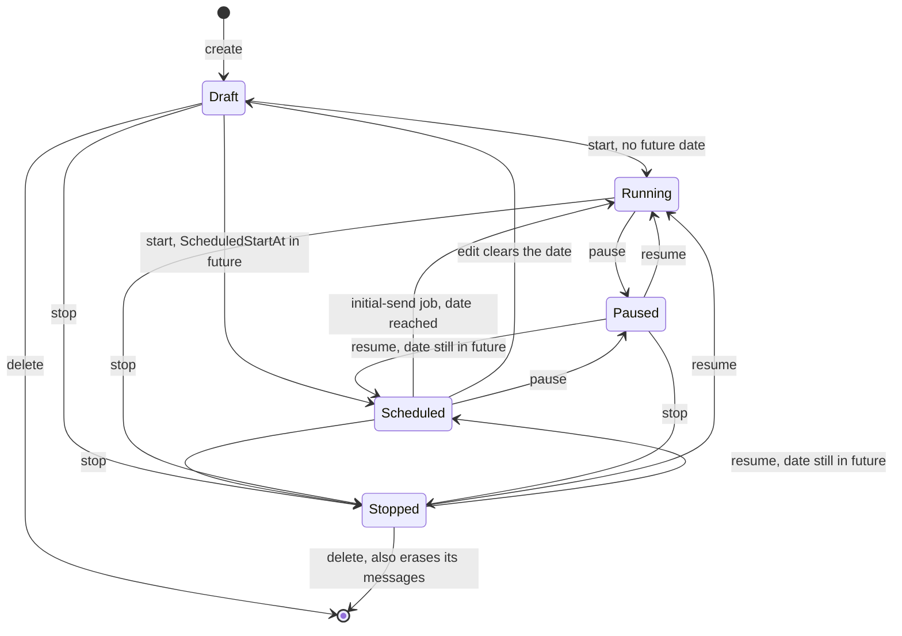
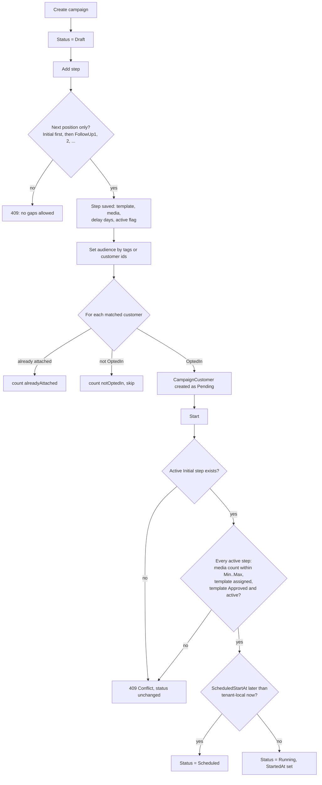
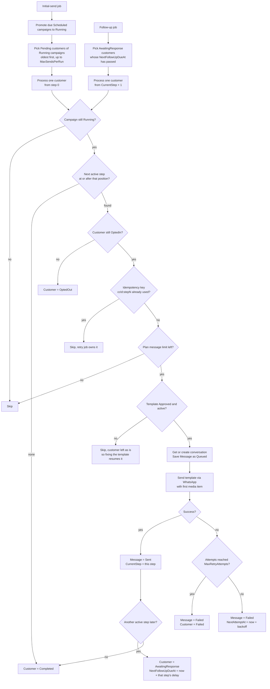
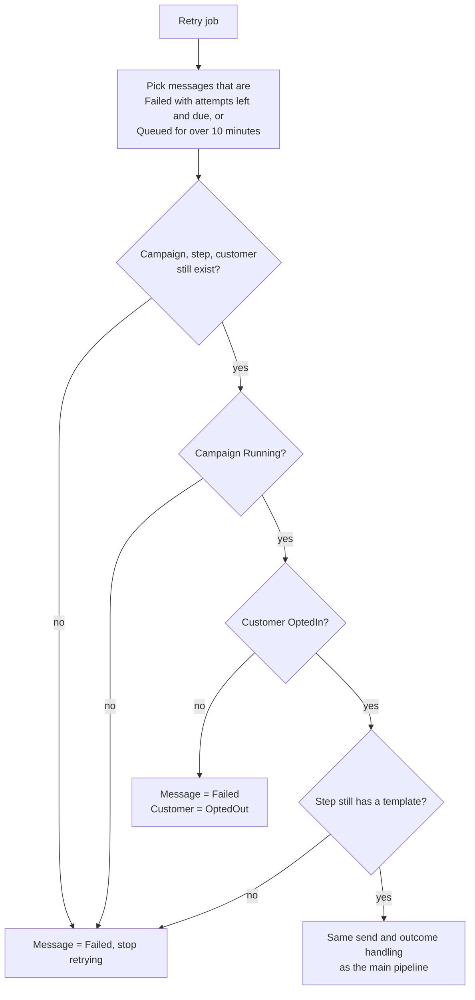
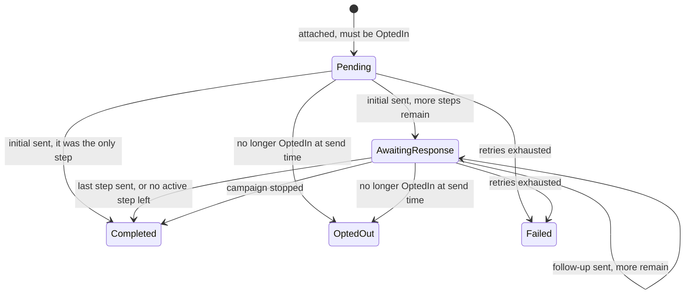

# Campaigns — flows

How a campaign moves from a draft to messages on a customer's phone. All charts are traced from the
code, not the design docs. Index of every module's charts: [docs/MODULE-FLOWS.md](../../../../docs/MODULE-FLOWS.md).

| Where the logic lives | File |
| --- | --- |
| UI action gating (what buttons show) | [campaign.model.ts](../../core/models/campaign.model.ts) — `canStartCampaign`, `canPauseCampaign`, … |
| HTTP calls | [campaign.service.ts](../../core/services/campaign.service.ts) |
| Lifecycle rules (API) | `AI-Sales-Automation-System-api/.../Application/Campaigns/CampaignService.cs` |
| Send pipeline (API) | `AI-Sales-Automation-System-api/.../Application/Messaging/CampaignSendService.cs` |
| Recurring jobs (API) | `.../Infrastructure/BackgroundJobs/CampaignInitialSenderJob.cs`, `FollowUpSchedulerJob.cs`, `MessageStatusRetryJob.cs` |

---

## 1. Campaign lifecycle

- **Resume is Start.** `ResumeAsync` calls `StartAsync`, so resuming re-runs the same validation (section 2)
  and clears `StoppedAt`.
- **Stop** force-completes every customer still `AwaitingResponse` with reason "Campaign stopped". Resuming
  does not revive them; it only reopens the campaign to `Pending` and newly attached customers.
- **`Completed` is never set** by any code path today. A campaign whose whole audience has finished stays
  `Running`.

| Action | Allowed from (API) |
| --- | --- |
| Edit name / description / date | Draft, Scheduled, Paused |
| Add / remove steps | Draft, Paused |
| Add audience | anything except Stopped, Completed |
| Start / Resume | Draft, Paused, Stopped |
| Pause | Running, Scheduled |
| Stop | Draft, Scheduled, Running, Paused |
| Delete | Draft, Stopped |
| Run jobs now (per campaign) | Scheduled, Running (UI only; elsewhere it's a no-op) |

## 2. Setting up and starting a campaign

Steps can only be removed from the end of the sequence. A step can be deactivated in place; the send
pipeline skips inactive steps rather than stopping at them.

## 3. Send pipeline (background jobs)

Three Hangfire jobs run per tenant: initial sends every minute, follow-ups every minute, retries every
5 minutes. `TenantJobRunner` skips the run if the tenant is gone, suspended, or the job is disabled in
the Platform Admin Console.

### Retry job

## 4. Campaign customer status

> **Known gap:** `Responded` and `HandedOff` exist in the enum and the progress legend, but nothing sets
> them. A customer who replies to a campaign keeps receiving its follow-ups; only an opt-out keyword
> (see [conversations/FLOWS.md](../conversations/FLOWS.md)) stops them.
