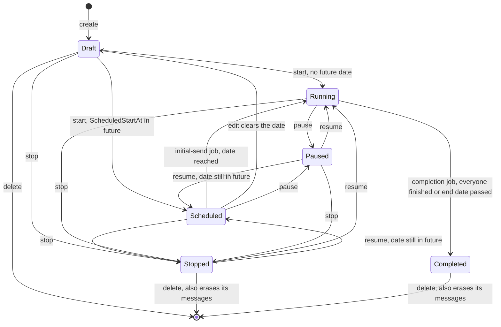
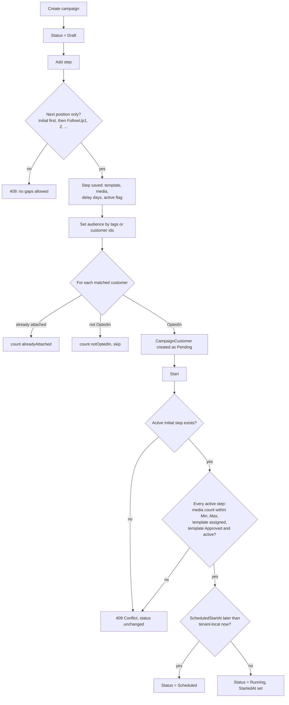
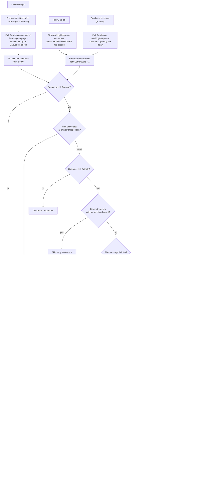
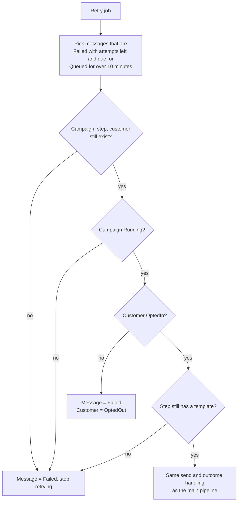
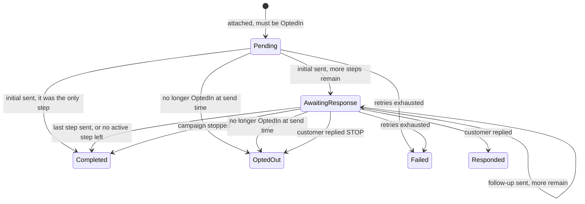
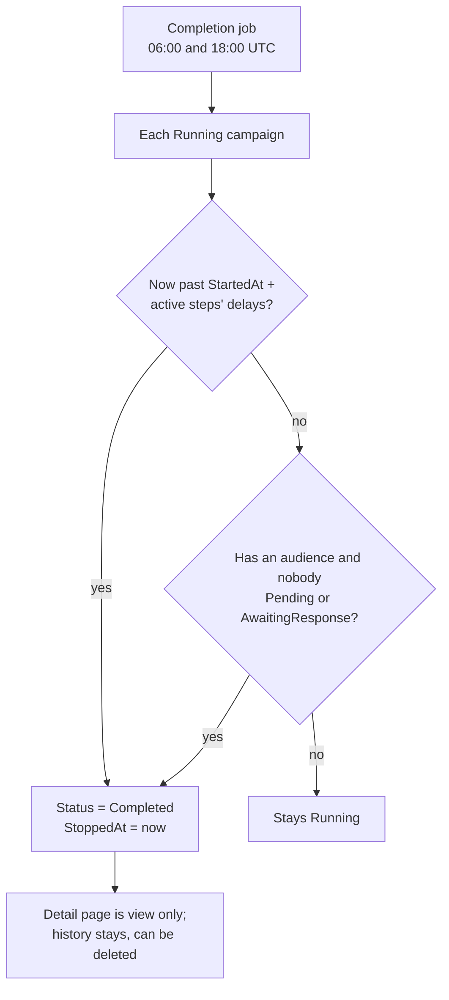

# Campaigns — flows

How a campaign moves from a draft to messages on a customer's phone. All charts are traced from the
code, not the design docs. Index of every module's charts: [docs/MODULE-FLOWS.md](../../../../docs/MODULE-FLOWS.md).

| Where the logic lives | File |
| --- | --- |
| UI action gating (what buttons show) | [campaign.model.ts](../../core/models/campaign.model.ts) — `canStartCampaign`, `canPauseCampaign`, … |
| HTTP calls | [campaign.service.ts](../../core/services/campaign.service.ts) |
| Lifecycle rules (API) | `AI-Sales-Automation-System-api/.../Application/Campaigns/CampaignService.cs` |
| Send pipeline (API) | `AI-Sales-Automation-System-api/.../Application/Messaging/CampaignSendService.cs` |
| Recurring jobs (API) | `.../Infrastructure/BackgroundJobs/CampaignInitialSenderJob.cs`, `FollowUpSchedulerJob.cs`, `MessageStatusRetryJob.cs`, `CampaignCompletionJob.cs` |
| Reply handling (API) | `.../Application/Webhooks/InboundWebhookProcessor.cs` — `MarkCampaignRepliesAsync` |

---

## 1. Campaign lifecycle

```mermaid
stateDiagram-v2
    [*] --> Draft : create
    Draft --> Running : start, no future date
    Draft --> Scheduled : start, ScheduledStartAt in future
    Scheduled --> Running : initial-send job, date reached
    Scheduled --> Draft : edit clears the date
    Running --> Paused : pause
    Scheduled --> Paused : pause
    Paused --> Running : resume
    Paused --> Scheduled : resume, date still in future
    Draft --> Stopped : stop
    Scheduled --> Stopped : stop
    Running --> Stopped : stop
    Paused --> Stopped : stop
    Stopped --> Running : resume
    Stopped --> Scheduled : resume, date still in future
    Running --> Completed : completion job, everyone finished or end date passed
    Draft --> [*] : delete
    Stopped --> [*] : delete, also erases its messages
    Completed --> [*] : delete, also erases its messages
```

- **Resume is Start.** `ResumeAsync` calls `StartAsync`, so resuming re-runs the same validation (section 2)
  and clears `StoppedAt`.
- **Stop** force-completes every customer still `AwaitingResponse` with reason "Campaign stopped". Resuming
  does not revive them; it only reopens the campaign to `Pending` and newly attached customers.
- **Completed is set automatically** by its own twice-daily job, `campaign-completion` (`CampaignSendService.CompleteFinishedCampaignsAsync`): a
  Running campaign closes when no audience member is `Pending` or `AwaitingResponse`, or when now is past
  `StartedAt` + the active steps' delays. `StoppedAt` records when. Completed is view-only and can be deleted.

| Action | Allowed from (API) |
| --- | --- |
| Edit name / description / date | Draft, Scheduled, Paused |
| Add / remove steps | Draft, Paused |
| Add audience | anything except Stopped, Completed |
| Start / Resume | Draft, Paused, Stopped |
| Pause | Running, Scheduled |
| Stop | Draft, Scheduled, Running, Paused |
| Delete | Draft, Stopped, Completed |
| Send next step now (force, skips the delay) | Running |
| Resend failed message(s) of a step | Running |

## 2. Setting up and starting a campaign

```mermaid
flowchart TD
    A["Create campaign"] --> B["Status = Draft"]
    B --> C["Add step"]
    C --> C1{"Next position only?<br/>Initial first, then FollowUp1, 2, ..."}
    C1 -- no --> C2["409: no gaps allowed"]
    C1 -- yes --> C3["Step saved: template, media,<br/>delay days, active flag"]
    C3 --> D["Set audience by tags or customer ids"]
    D --> D1{"For each matched customer"}
    D1 -- already attached --> D2["count alreadyAttached"]
    D1 -- not OptedIn --> D3["count notOptedIn, skip"]
    D1 -- OptedIn --> D4["CampaignCustomer created as Pending"]
    D4 --> E["Start"]
    E --> V1{"Active Initial step exists?"}
    V1 -- no --> X["409 Conflict, status unchanged"]
    V1 -- yes --> V2{"Every active step:<br/>media count within Min..Max,<br/>template assigned,<br/>template Approved and active?"}
    V2 -- no --> X
    V2 -- yes --> V3{"ScheduledStartAt later than<br/>tenant-local now?"}
    V3 -- yes --> S["Status = Scheduled"]
    V3 -- no --> R["Status = Running, StartedAt set"]
```

Steps can only be removed from the end of the sequence. A step can be deactivated in place; the send
pipeline skips inactive steps rather than stopping at them.

## 3. Send pipeline (background jobs)

Four Hangfire jobs run per tenant. Default schedules (UTC, editable by the tenant Admin from the
Campaign jobs panel on the Campaigns page): initial sends 06:00, follow-ups 07:00, retries 08:00, and
the completion job twice a day at 06:00 and 18:00. `TenantJobRunner` skips the run if the tenant is gone,
suspended, or the job is paused, and pushes live `JobStarted` / `JobFinished` events so the campaign
pages refresh themselves and grey out "Run now" while a run is in progress.

Two manual paths use the same "process one customer" logic below: **Send next step now** on the
campaign detail page (everyone eligible, or one customer) skips the follow-up delay, and **Resend** on
the step delivery card retries Failed messages. Both need the campaign to be Running.

```mermaid
flowchart TD
    J1["Initial-send job"] --> P["Promote due Scheduled campaigns to Running"]
    P --> Q1["Pick Pending customers of Running campaigns<br/>oldest first, up to MaxSendsPerRun"]
    J2["Follow-up job"] --> Q2["Pick AwaitingResponse customers<br/>whose NextFollowUpDueAt has passed"]
    J3["Send next step now<br/>(manual)"] --> Q3["Pick Pending or AwaitingResponse<br/>customers, ignoring the delay"]
    Q3 --> O2
    Q1 --> O["Process one customer<br/>from step 0"]
    Q2 --> O2["Process one customer<br/>from CurrentStep + 1"]
    O --> K1
    O2 --> K1
    K1{"Campaign still Running?"} -- no --> SK["Skip"]
    K1 -- yes --> K2{"Next active step<br/>at or after that position?"}
    K2 -- none --> DONE["Customer = Completed"]
    K2 -- found --> K3{"Customer still OptedIn?"}
    K3 -- no --> OO["Customer = OptedOut"]
    K3 -- yes --> K4{"Idempotency key<br/>ccId:stepN already used?"}
    K4 -- yes --> SK2["Skip, retry job owns it"]
    K4 -- no --> K5{"Plan message limit left?"}
    K5 -- no --> SK
    K5 -- yes --> K6{"Template Approved and active?"}
    K6 -- no --> SK3["Skip, customer left as is<br/>so fixing the template resumes it"]
    K6 -- yes --> M["Get or create conversation<br/>Save Message as Queued"]
    M --> W["Send template via WhatsApp<br/>with first media item"]
    W --> WR{"Success?"}
    WR -- yes --> OK["Message = Sent<br/>CurrentStep = this step"]
    OK --> NX{"Another active step later?"}
    NX -- yes --> AW["Customer = AwaitingResponse<br/>NextFollowUpDueAt = now + that step's delay"]
    NX -- no --> DONE
    WR -- no --> F{"Attempts reached MaxRetryAttempts?"}
    F -- yes --> FL["Message = Failed<br/>Customer = Failed"]
    F -- no --> BO["Message = Failed<br/>NextAttemptAt = now + backoff"]
```

### Retry job

```mermaid
flowchart TD
    R["Retry job"] --> RQ["Pick messages that are<br/>Failed with attempts left and due, or<br/>Queued for over 10 minutes"]
    RQ --> R1{"Campaign, step, customer<br/>still exist?"}
    R1 -- no --> AB["Message = Failed, stop retrying"]
    R1 -- yes --> R2{"Campaign Running?"}
    R2 -- no --> AB
    R2 -- yes --> R3{"Customer OptedIn?"}
    R3 -- no --> AB2["Message = Failed<br/>Customer = OptedOut"]
    R3 -- yes --> R4{"Step still has a template?"}
    R4 -- no --> AB
    R4 -- yes --> SEND["Same send and outcome handling<br/>as the main pipeline"]
```

## 4. Campaign customer status

```mermaid
stateDiagram-v2
    [*] --> Pending : attached, must be OptedIn
    Pending --> AwaitingResponse : initial sent, more steps remain
    Pending --> Completed : initial sent, it was the only step
    AwaitingResponse --> AwaitingResponse : follow-up sent, more remain
    AwaitingResponse --> Completed : last step sent, or no active step left
    AwaitingResponse --> Completed : campaign stopped
    Pending --> OptedOut : no longer OptedIn at send time
    AwaitingResponse --> OptedOut : no longer OptedIn at send time
    Pending --> Failed : retries exhausted
    AwaitingResponse --> Failed : retries exhausted
    AwaitingResponse --> Responded : customer replied
    AwaitingResponse --> OptedOut : customer replied STOP
```

A reply (`InboundWebhookProcessor`) moves every campaign membership that is `AwaitingResponse` to
`Responded`, records `LastCustomerResponseAt` and clears `NextFollowUpDueAt`, so no further follow-ups go
out. A `Pending` customer was never contacted, so a message from them changes nothing.

## 5. Closing a campaign

```mermaid
flowchart TD
    CJ["Completion job<br/>06:00 and 18:00 UTC"] --> L["Each Running campaign"]
    L --> E1{"Now past StartedAt +<br/>active steps' delays?"}
    E1 -- yes --> C["Status = Completed<br/>StoppedAt = now"]
    E1 -- no --> E2{"Has an audience and nobody<br/>Pending or AwaitingResponse?"}
    E2 -- yes --> C
    E2 -- no --> KEEP["Stays Running"]
    C --> V["Detail page is view only;<br/>history stays, can be deleted"]
```

> **Known gap:** `HandedOff` exists in the enum and the progress legend, but nothing sets it for a
> campaign customer yet.
