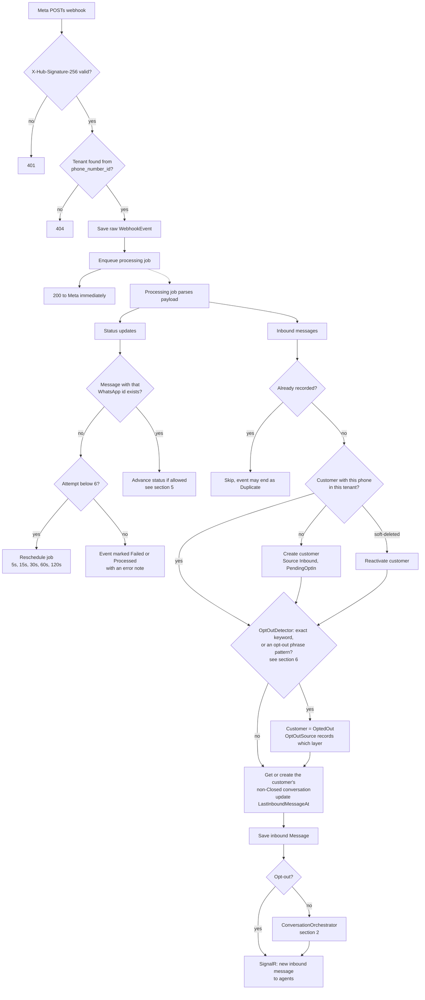
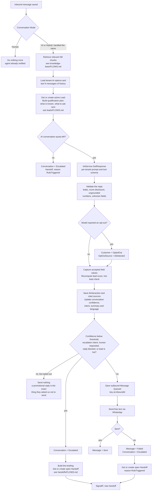
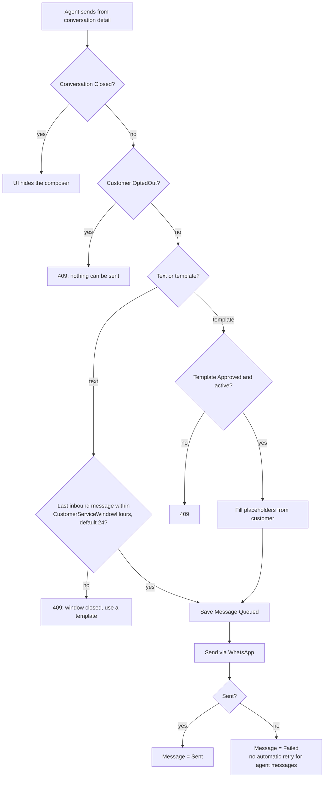
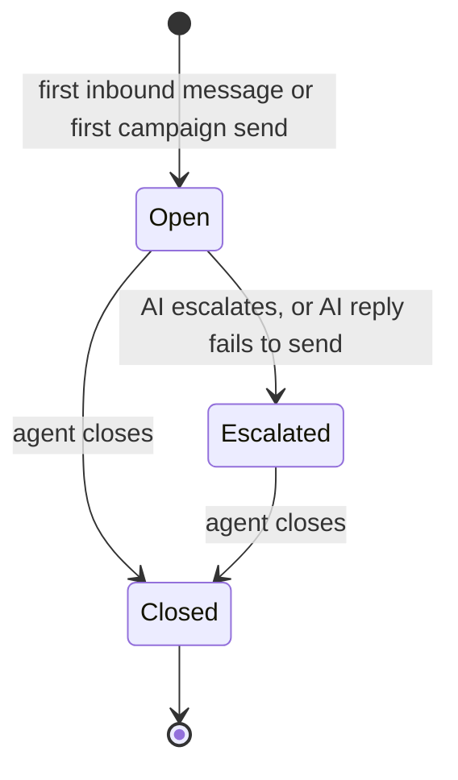
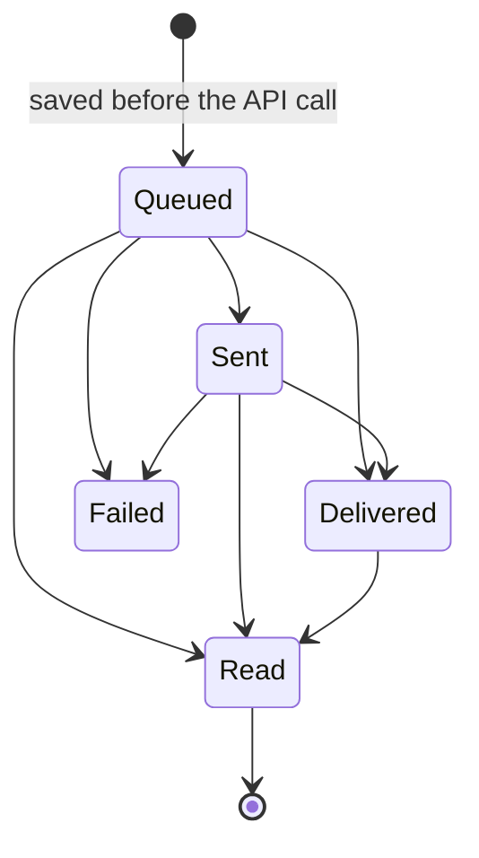
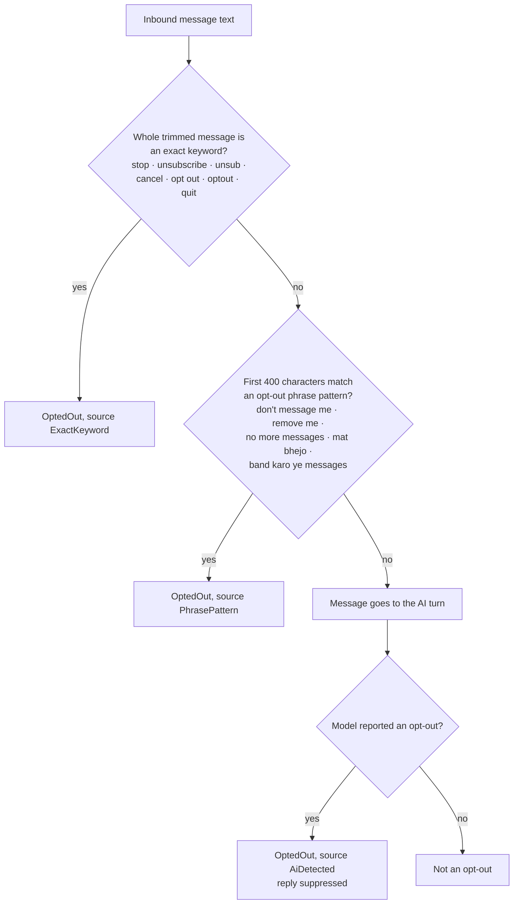

# Conversations — flows

What happens between a customer's WhatsApp message arriving and a reply (from the AI or an agent) going
back. All charts are traced from the code. Index of every module's charts:
[docs/MODULE-FLOWS.md](../../../../docs/MODULE-FLOWS.md).

| Where the logic lives | File |
| --- | --- |
| UI rules (window, closed) | [conversation.model.ts](../../core/models/conversation.model.ts) — `canSendFreeText`, `canActOnConversation` |
| HTTP calls | [conversation.service.ts](../../core/services/conversation.service.ts) |
| Webhook entry (API) | `AI-Sales-Automation-System-api/.../Api/Controllers/WebhooksController.cs` |
| Inbound processing (API) | `.../Application/Webhooks/InboundWebhookProcessor.cs`, `.../Infrastructure/BackgroundJobs/InboundWebhookProcessingJob.cs` |
| AI decision (API) | `.../Application/Ai/ConversationOrchestrator.cs` |
| Opt-out detection (API) | `.../Application/Common/OptOutDetector.cs` (layers 1-2), `.../Application/Ai/AiReplyValidator.cs` (layer 3) |
| Agent actions (API) | `.../Application/Conversations/ConversationService.cs` |

---

## 1. Inbound webhook, end to end

An opt-out never reaches the AI and never raises a handoff; opting out is treated as the resolution.
A message the two deterministic layers do not catch still goes to the AI, which has its own opt-out
reading — see section 6.

## 2. AI orchestrator decision

The AI is skipped **only** when Mode is `Human`. An `Escalated` conversation in AI mode is still answered
by the AI on the next inbound message.

Nothing the model returns is acted on before validation. The model judges, phrases and extracts; code
decides which field is asked next, what the turn is worth, whether the lead is hot, and whether the
reply may be sent at all.

## 3. Agent sends a message

The UI checks the 24-hour window with its own default; the API is the authority and re-checks with the
tenant's configured value.

## 4. Conversation status

- Mode (`AI` / `Human` / `Hybrid`) and the assigned agent are set independently at any time until Closed.
- A Closed conversation is history. The customer's next message, or next campaign send, starts a new one.
- **Nothing moves `Escalated` back to `Open`.** Resolving the handoff does not change the conversation.

## 5. Message delivery status

Delivered and Read only arrive through status webhooks. Out-of-order or stale events that would move a
message backwards are ignored. Inbound messages are stored as `Delivered`.

## 6. Opt-out detection

Three layers, two of them deterministic and both in the webhook processor before any AI call.

- **Why the model is trusted here.** A false positive stops promotional messages to someone who may
  not have asked. A false negative keeps sending to someone who did, which is a compliance violation.
  Those are not equal, so this leans toward detecting. The same reasoning would not justify trusting
  the model with a flag that *removed* a restriction.
- **Leaning toward detection is not loose matching.** Every phrase pattern is anchored on "me" or on a
  messaging noun, because this runs inside a sales conversation: "3BHK nahi chahiye" is a customer
  narrowing their requirement, not leaving, and opting them out over it would be worse than useless.
- **Why the source is recorded.** `Customer.OptOutSource` answers the compliance question "did they
  really ask us to stop?", and marks the AI-detected ones as the only non-deterministic path — the
  ones worth spot-checking. `Manual` covers an agent setting it on the customer record, or an import.
- **Nothing is sent after an opt-out**, not even an acknowledgement. The design allows a fixed
  acknowledgement template as a tenant option; it is not built, and silence is the safer default.
