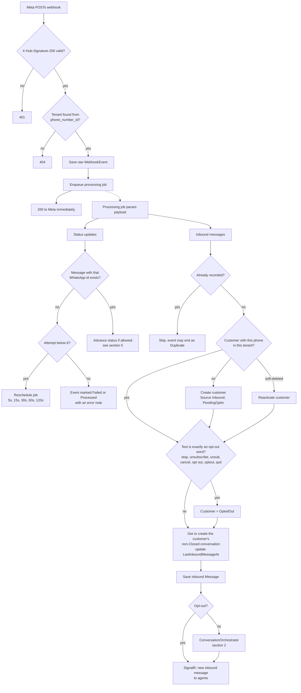
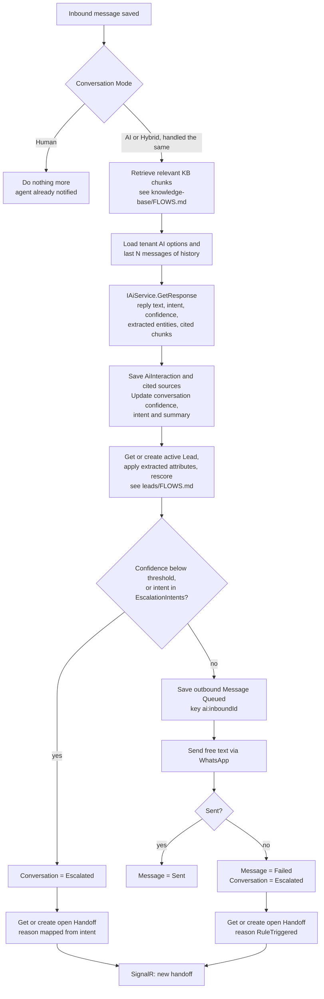
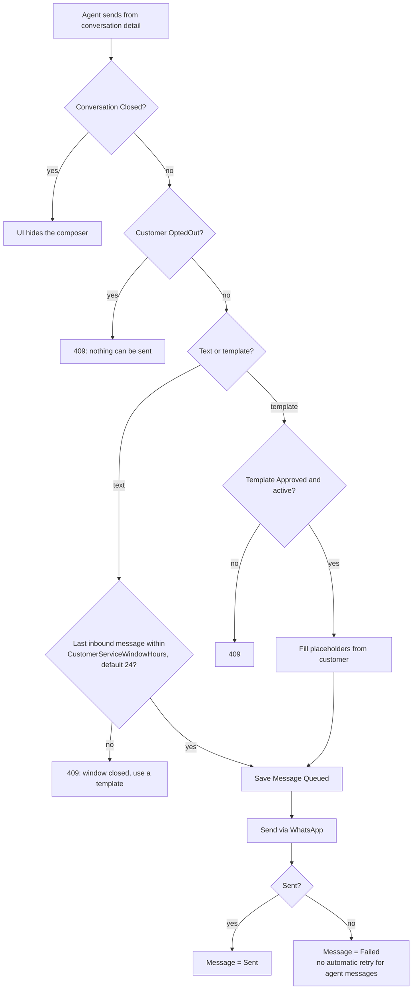
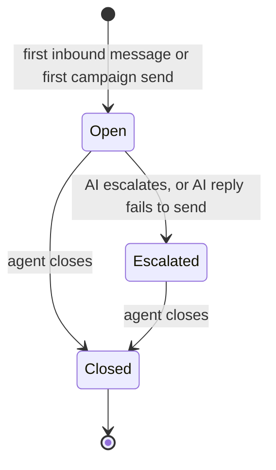
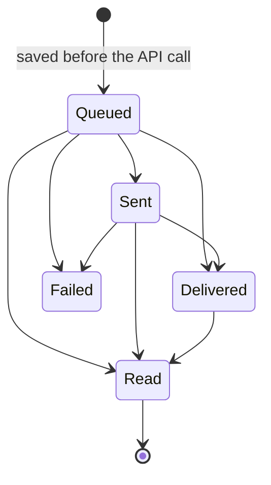

# Conversations — flows

What happens between a customer's WhatsApp message arriving and a reply (from the AI or an agent) going
back. All charts are traced from the code. Index of every module's charts:
[docs/MODULE-FLOWS.md](../../../../docs/MODULE-FLOWS.md).

| Where the logic lives | File |
| --- | --- |
| UI rules (window, closed) | [conversation.model.ts](../../core/models/conversation.model.ts) — `canSendFreeText`, `canActOnConversation` |
| HTTP calls | [conversation.service.ts](../../core/services/conversation.service.ts) |
| Webhook entry (API) | `AI-Sales-Automation-System-api/.../Api/Controllers/WebhooksController.cs` |
| Inbound processing (API) | `.../Application/Webhooks/InboundWebhookProcessor.cs`, `.../Infrastructure/BackgroundJobs/InboundWebhookProcessingJob.cs` |
| AI decision (API) | `.../Application/Ai/ConversationOrchestrator.cs` |
| Agent actions (API) | `.../Application/Conversations/ConversationService.cs` |

---

## 1. Inbound webhook, end to end

An opt-out never reaches the AI and never raises a handoff; opting out is treated as the resolution.

## 2. AI orchestrator decision

The AI is skipped **only** when Mode is `Human`. An `Escalated` conversation in AI mode is still answered
by the AI on the next inbound message.

## 3. Agent sends a message

The UI checks the 24-hour window with its own default; the API is the authority and re-checks with the
tenant's configured value.

## 4. Conversation status

- Mode (`AI` / `Human` / `Hybrid`) and the assigned agent are set independently at any time until Closed.
- A Closed conversation is history. The customer's next message, or next campaign send, starts a new one.
- **Nothing moves `Escalated` back to `Open`.** Resolving the handoff does not change the conversation.

## 5. Message delivery status

Delivered and Read only arrive through status webhooks. Out-of-order or stale events that would move a
message backwards are ignored. Inbound messages are stored as `Delivered`.
