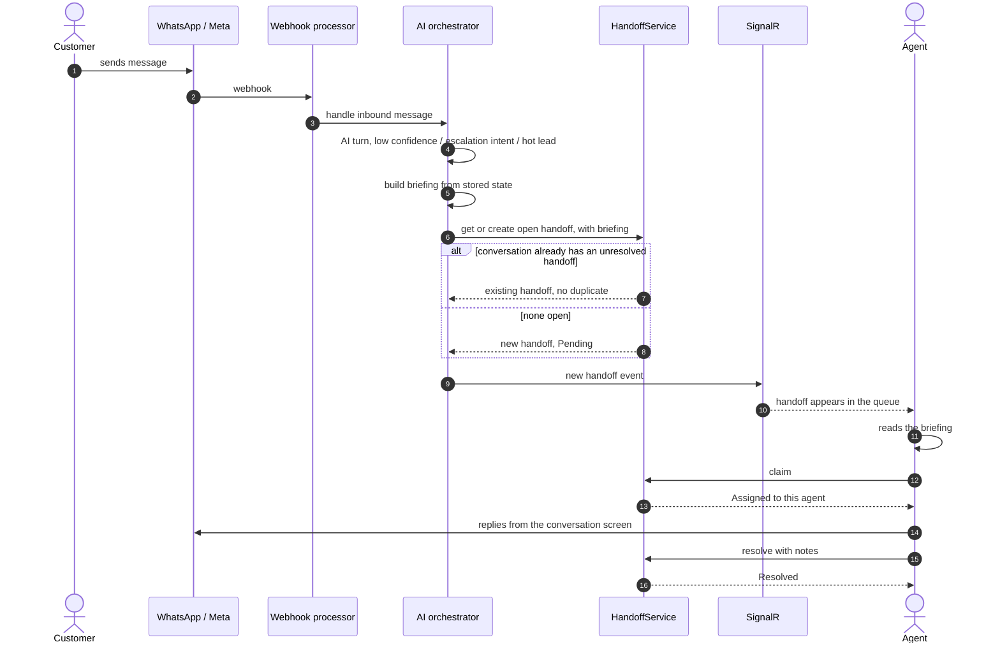
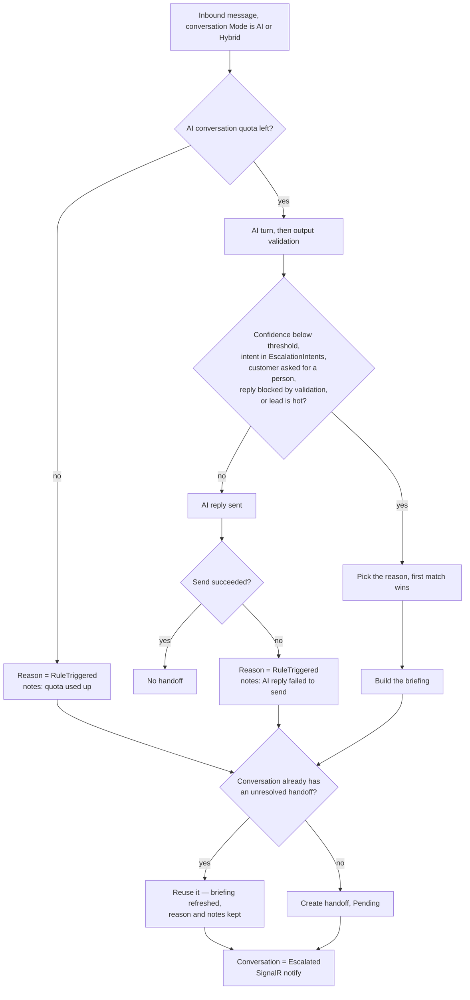
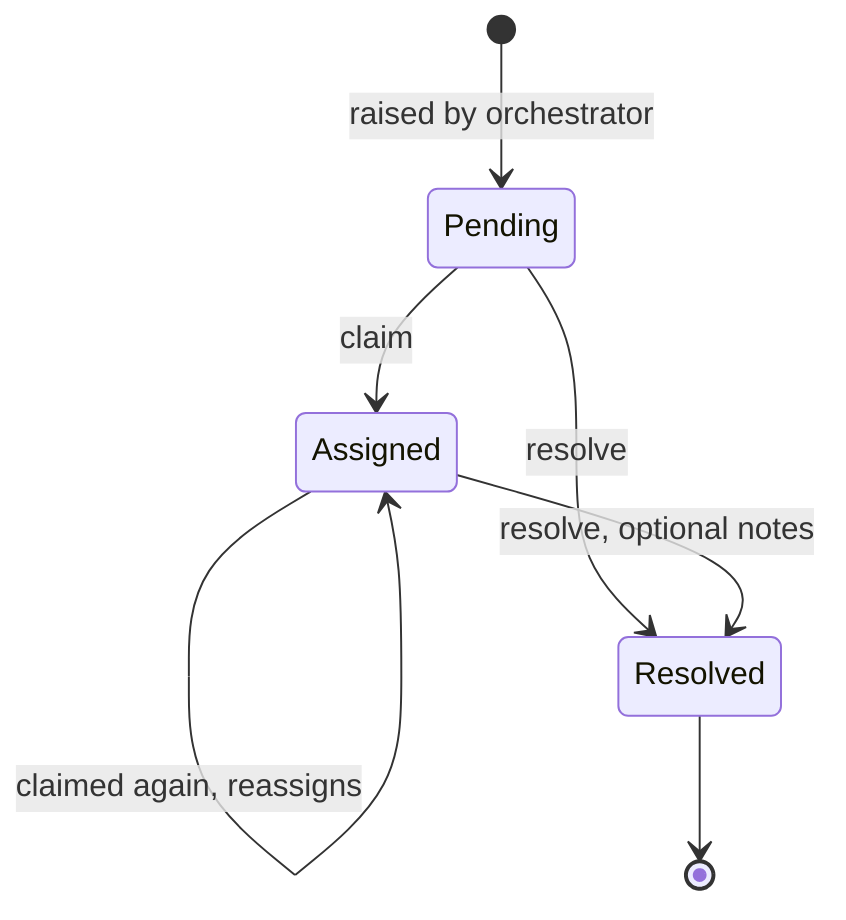
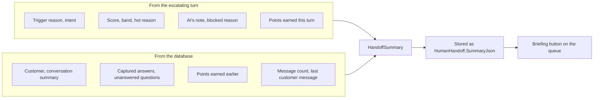

# Handoffs — flows

How a conversation gets handed from the AI to a human agent, and how the agent works it. All charts are
traced from the code. Index of every module's charts:
[docs/MODULE-FLOWS.md](../../../../docs/MODULE-FLOWS.md).

| Where the logic lives | File |
| --- | --- |
| UI rules | [handoff.model.ts](../../core/models/handoff.model.ts) — `canClaimHandoff`, `canResolveHandoff`, `handoffTriggerReasonLabel` |
| Briefing card | [handoff-summary-card](./handoff-summary-card/handoff-summary-card.component.ts) |
| HTTP calls | [handoff.service.ts](../../core/services/handoff.service.ts) |
| Raised by (API) | `AI-Sales-Automation-System-api/.../Application/Ai/ConversationOrchestrator.cs` |
| Claim / resolve (API) | `.../Application/Handoffs/HandoffService.cs` |
| Briefing built by (API) | `.../Application/Handoffs/HandoffSummaryBuilder.cs` |

---

## 1. End to end

## 2. When a handoff is raised

The reason is picked in this order, in the queue's terms rather than the model's — an explicit
request first, then a customer ready to buy, then why the AI could not proceed, then the intent:

| # | Condition | Reason |
| --- | --- | --- |
| 1 | Customer asked for a person | `CustomerRequested` |
| 2 | Lead scored hot this turn | `HotLead` |
| 3 | Reply blocked by output validation | `CannotAnswer` |
| 4 | Intent is Complaint / Negotiation / Support | `Complaint` / `Negotiation` / `ComplexTechnical` |
| 5 | Intent is PurchaseIntent, Booking, DemoRequest, AppointmentRequest or SiteVisit | `HotLead` |
| 6 | Anything else | `LowConfidence` |

`KnowledgeGap` and `BusinessRule` are in the enum for tenant-configured escalation rules; nothing
raises them yet.

Handoffs are never raised for: Human-mode conversations, opt-out keywords, or agent-sent messages.

## 3. Handoff status

- The queue lists Pending first, then Assigned, Resolved last; oldest first within each.
- A Resolved handoff cannot be claimed (409). Claim and Resolve are offered for anything not yet Resolved.
- **`InProgress` is never set** by any code path.

> **What resolving does not do:** the conversation stays `Escalated` and keeps its Mode. If the Mode is
> still `AI`, the AI answers the customer's next message. To stop the AI while a person handles it, switch
> the conversation to `Human` from the conversation screen.

## 4. The briefing

Assembled from stored state when the handoff is raised — never by asking the model to summarise.
Everything in it is already known for certain, so a model pass would only add something else to
verify.

- **A snapshot, not a live view.** The lead keeps changing after the escalation; a card regenerated
  on open would quietly describe a different situation than the one that caused it. It *is* refreshed
  when a later turn escalates again on the same open handoff, because then the situation genuinely
  changed.
- **This turn's points are passed in, not queried back.** At escalation they are still on the change
  tracker, so a builder left to look them up would omit exactly the points that caused the
  escalation.
- **The score breakdown is shown on purpose.** A configurable scoring system whose workings nobody
  can see is a black box, and sales teams stop trusting black boxes.
- **A value the model was unsure of is not presented as known.** Below the confidence floor it stays
  on record but is listed as a gap, because that is what it is.
- `summary` is null for a handoff raised before briefings existed, or by a path that does not build
  one — the Briefing button is disabled there rather than hidden.
