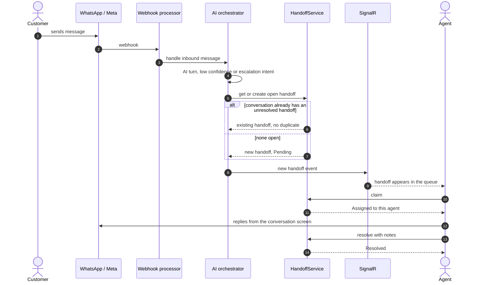
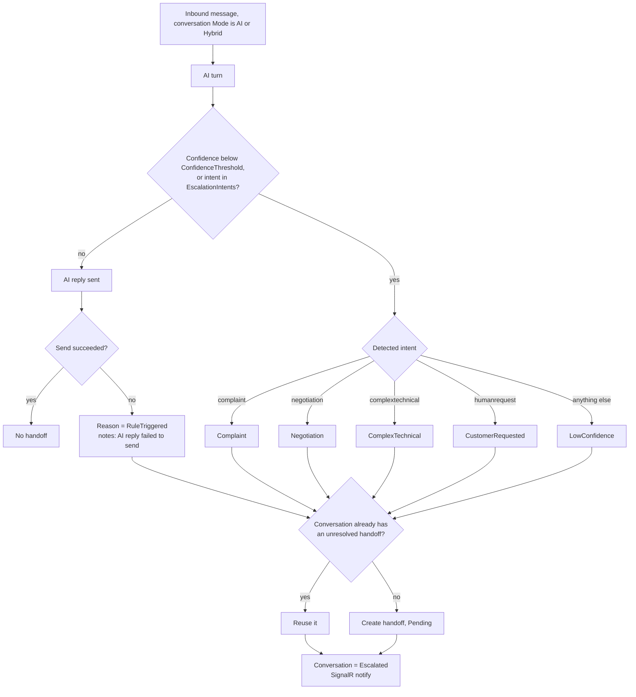
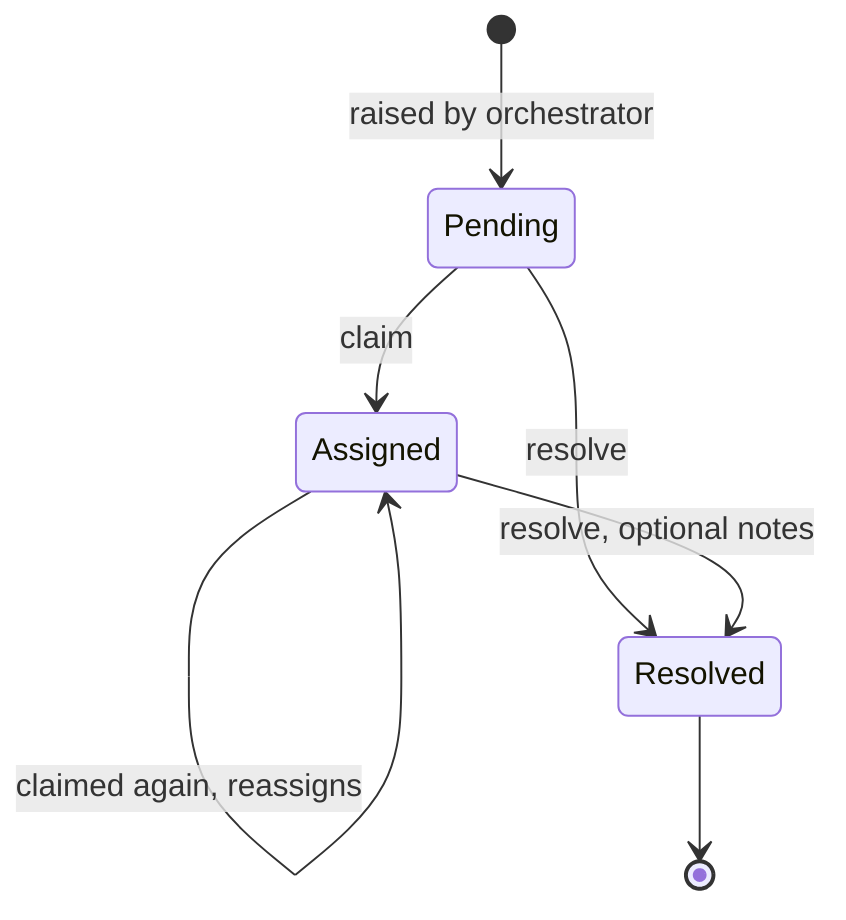

# Handoffs — flows

How a conversation gets handed from the AI to a human agent, and how the agent works it. All charts are
traced from the code. Index of every module's charts:
[docs/MODULE-FLOWS.md](../../../../docs/MODULE-FLOWS.md).

| Where the logic lives | File |
| --- | --- |
| UI rules | [handoff.model.ts](../../core/models/handoff.model.ts) — `canClaimHandoff`, `canResolveHandoff` |
| HTTP calls | [handoff.service.ts](../../core/services/handoff.service.ts) |
| Raised by (API) | `AI-Sales-Automation-System-api/.../Application/Ai/ConversationOrchestrator.cs` |
| Claim / resolve (API) | `.../Application/Handoffs/HandoffService.cs` |

---

## 1. End to end

## 2. When a handoff is raised

Handoffs are never raised for: Human-mode conversations, opt-out keywords, or agent-sent messages.
`CannotAnswer` exists in the enum but no intent maps to it.

## 3. Handoff status

- The queue lists Pending first, then Assigned, Resolved last; oldest first within each.
- A Resolved handoff cannot be claimed (409). Claim and Resolve are offered for anything not yet Resolved.
- **`InProgress` is never set** by any code path.

> **What resolving does not do:** the conversation stays `Escalated` and keeps its Mode. If the Mode is
> still `AI`, the AI answers the customer's next message. To stop the AI while a person handles it, switch
> the conversation to `Human` from the conversation screen.
