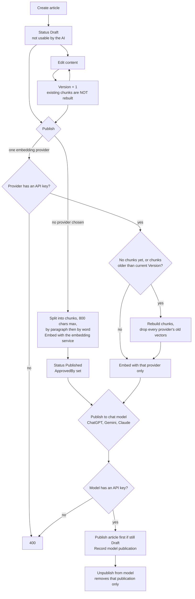
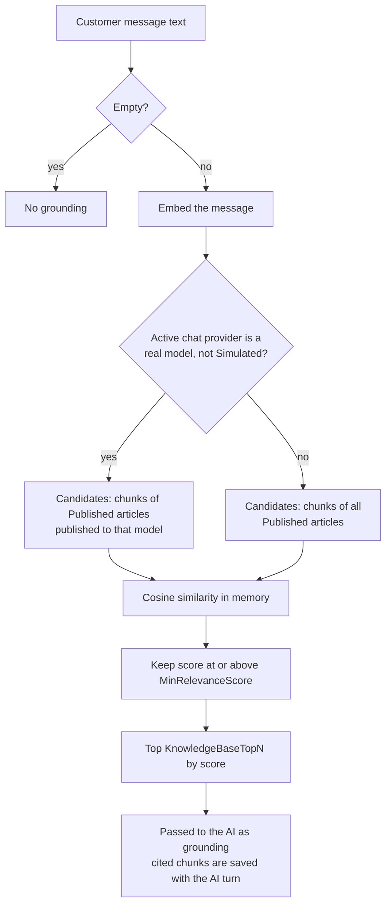

# Knowledge base — flows

How an article becomes something the AI can quote, and how it's found at reply time. All charts are
traced from the code. Index of every module's charts: [docs/MODULE-FLOWS.md](../../../../docs/MODULE-FLOWS.md).

| Where the logic lives | File |
| --- | --- |
| UI rules and provider names | [knowledge-base.model.ts](../../core/models/knowledge-base.model.ts) — `canPublishArticle` |
| HTTP calls | [knowledge-base.service.ts](../../core/services/knowledge-base.service.ts) |
| Publish, embed, retrieve (API) | `AI-Sales-Automation-System-api/.../Application/KnowledgeBase/KnowledgeBaseService.cs` |
| Caller at reply time (API) | `.../Application/Ai/ConversationOrchestrator.cs` |

Two separate switches decide whether the AI can use an article:

1. **Embedded** — the article is `Published`, split into chunks, and each chunk has a vector.
2. **Published to a chat model** — ChatGPT, Gemini or Claude is allowed to use it.

---

## 1. Article lifecycle

- **Reindex** re-embeds every Published article whose chunks are older than its current Version. Use it
  after editing live articles.
- **Bulk publish** runs one article at a time and reports not-found and failed ids instead of failing the
  whole call.
- `Archived` exists but no action sets it, so there's nothing to un-archive.

## 2. Retrieval at reply time

An article that is Published but not published to the active chat model is **not** retrieved in
production. It is only visible to the AI when the Simulated provider is active.
