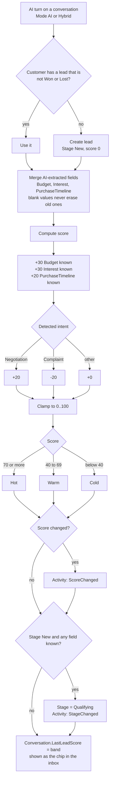
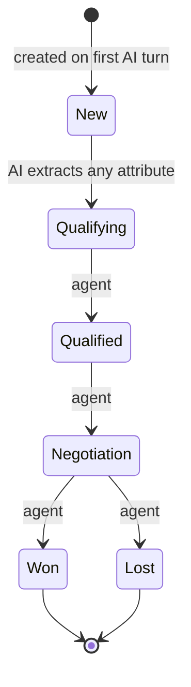
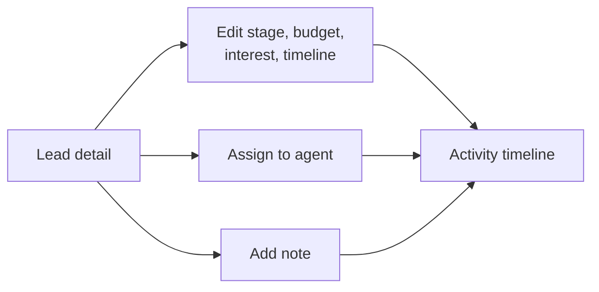

# Leads — flows

How leads are created and scored by the AI, and what agents can change. All charts are traced from the
code. Index of every module's charts: [docs/MODULE-FLOWS.md](../../../../docs/MODULE-FLOWS.md).

| Where the logic lives | File |
| --- | --- |
| UI rules | [lead.model.ts](../../core/models/lead.model.ts) — `canEditLead` |
| HTTP calls | [lead.service.ts](../../core/services/lead.service.ts) |
| Creation and scoring (API) | `AI-Sales-Automation-System-api/.../Application/Leads/LeadService.cs` |
| Caller (API) | `.../Application/Ai/ConversationOrchestrator.cs` |

---

## 1. AI turn updates the lead

AI-written activities have no `createdBy`; agent notes and edits carry the agent's id.

## 2. Stages

- Only **New → Qualifying** is automatic. Every other move is an agent's edit, and the API allows any stage
  to any stage; the chart shows the normal forward path.
- The UI hides editing on Won and Lost leads (the API does not block it).
- Once a lead is Won or Lost, the customer's next AI turn starts a **new** lead.

## 3. Agent actions

