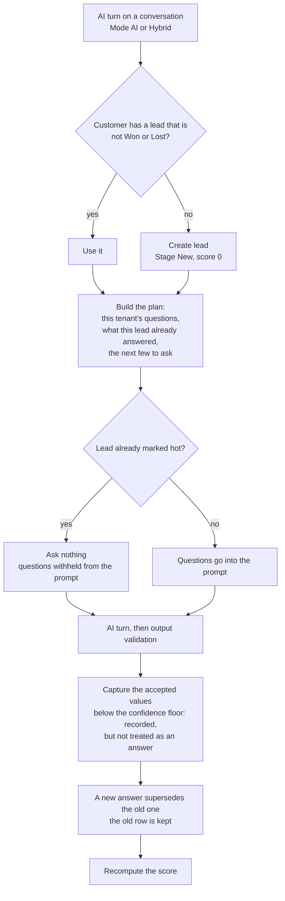
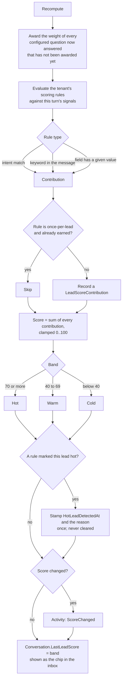
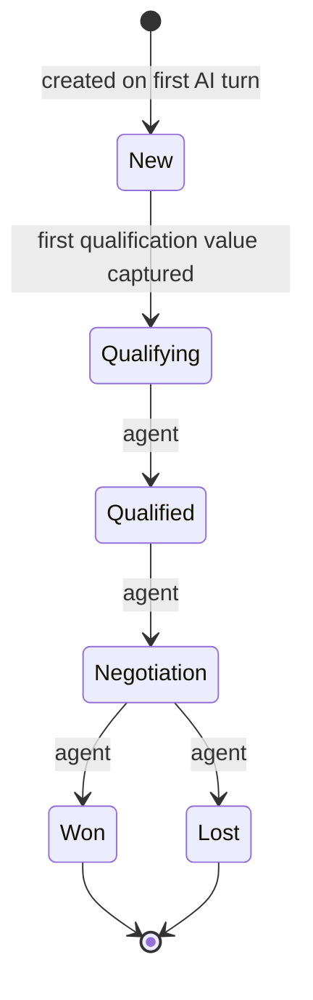
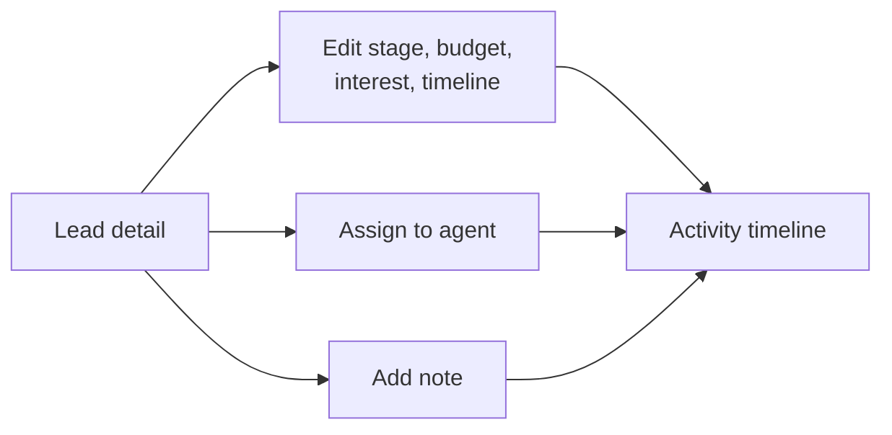

# Leads — flows

How leads are created and scored by the AI, and what agents can change. All charts are traced from the
code. Index of every module's charts: [docs/MODULE-FLOWS.md](../../../../docs/MODULE-FLOWS.md).

| Where the logic lives | File |
| --- | --- |
| UI rules | [lead.model.ts](../../core/models/lead.model.ts) — `canEditLead` |
| HTTP calls | [lead.service.ts](../../core/services/lead.service.ts) |
| Creation and agent edits (API) | `AI-Sales-Automation-System-api/.../Application/Leads/LeadService.cs` |
| What to ask next, and capture (API) | `.../Application/Leads/QualificationPlanner.cs` |
| Scoring (API) | `.../Application/Leads/LeadScoringService.cs` |
| Configuration (API) | `.../Application/Leads/QualificationAdminService.cs`, `LeadScoringAdminService.cs` |
| Caller (API) | `.../Application/Ai/ConversationOrchestrator.cs` |

---

## 1. AI turn updates the lead

The three hardcoded attributes are gone. Each tenant configures its own qualification questions and
its own scoring rules, and the model never decides what anything is worth — it reports what happened,
and code prices it.

## 1a. How the score is built

- **Contributions accumulate; they are not recomputed from scratch each turn.** A signal once earned
  stays earned. The old heuristic re-derived the intent bonus every turn, so a lead that negotiated
  and then asked something harmless silently lost it.
- **Every contribution is stored with the rule or field that produced it.** A score nobody can take
  apart is one the sales team learns to ignore, which is also why it travels with the handoff
  briefing and why `LeadScoreContribution` exists as a table.
- **The hot mark is permanent, the band is current state.** A lead can read Cold today and still be
  one the rules fired on last week; the agent performance report counts them separately for that
  reason.

AI-written activities have no `createdBy`; agent notes and edits carry the agent's id.

## 2. Stages

- Only **New → Qualifying** is automatic, and it happens where capture happens, not where scoring
  does. Every other move is an agent's edit, and the API allows any stage to any stage; the chart
  shows the normal forward path.
- The UI hides editing on Won and Lost leads (the API does not block it).
- Once a lead is Won or Lost, the customer's next AI turn starts a **new** lead.

## 3. Agent actions

## 4. Is any of it working?

Configuration this open needs a way to tell whether a question earns its place. **Agent Performance**
(Workspace → Agent Performance, Admin only) answers that from what the orchestrator already records:

- **Ask effectiveness** per question — asked in 80 conversations and answered in 12 is a badly phrased
  question, not a stubborn customer. Values the customer volunteered before being asked are counted
  separately, since they prove nothing about the question.
- **Turns to answer** — a question that takes four turns is costing the conversation its patience.
- **Hot conversion against everyone else** — if leads the rules mark hot do not close better than the
  rest, the rules are measuring something that is not buying intent, and the fix is in the rules.
