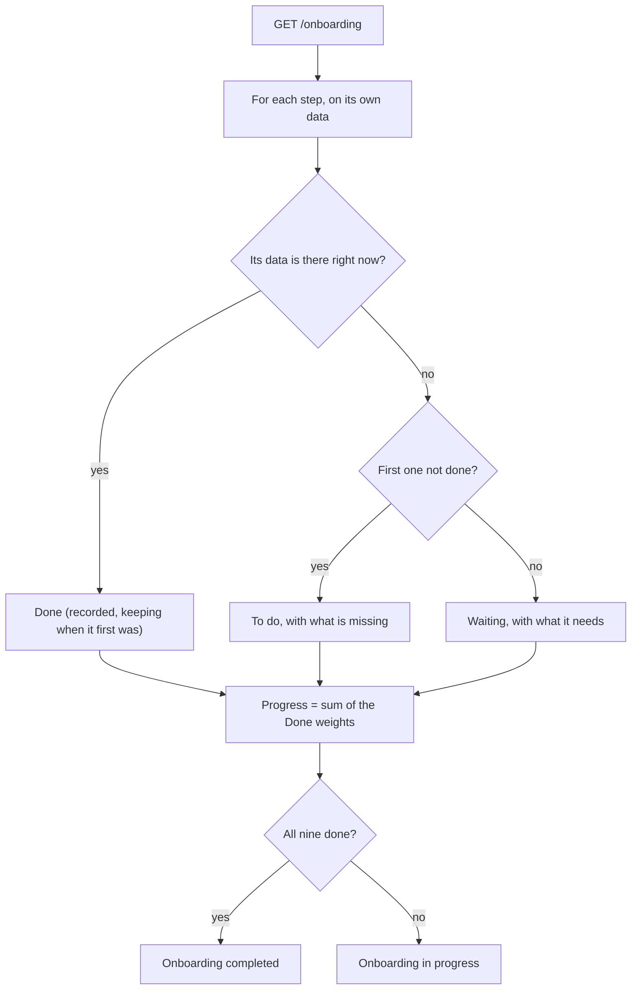
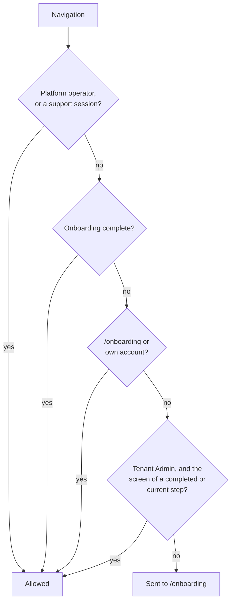

# Onboarding — flows

How a tenant is taken through setup after signing in, and what it can reach until setup is done. All charts are
traced from the code. Index of every module's charts: [docs/MODULE-FLOWS.md](../../../../docs/MODULE-FLOWS.md).

| Where the logic lives | File |
| --- | --- |
| The widget ("Complete Your Application Setup") | [onboarding-page.component.ts](onboarding-page/onboarding-page.component.ts) |
| A step's real screen, shown in the panel | [onboarding-step-host.component.ts](step-panel/onboarding-step-host.component.ts), [onboarding-areas.ts](step-panel/onboarding-areas.ts) |
| Re-check after every save | [onboarding-progress.interceptor.ts](../../core/interceptors/onboarding-progress.interceptor.ts) |
| Who may go where while onboarding | [onboarding.guard.ts](../../core/guards/onboarding.guard.ts) |
| No sidenav, the "Back to setup" bar | [shell.component.ts](../../layout/shell/shell.component.ts) |
| Status, cached once complete | [onboarding.service.ts](../../core/services/onboarding.service.ts) |
| Steps, order, weights (API) | `AI-Sales-Automation-System-api/.../Application/Onboarding/OnboardingCatalog.cs` |
| What completes each step (API) | `.../Application/Onboarding/OnboardingService.cs` |

---

## 1. The steps

Listed in this order. Progress is the sum of the weights of the steps whose data is in place (they add up to 100) -
every step is judged on its own data, in any order, so a tenant who already has eight steps' worth of data sees 85%,
not the share before the first gap.
Each step is judged by the data its screen saves. There is no "mark as done" button.

## 1a. One page, two parts

The wizard is one page: the steps on the left, the selected step on the right. The right part shows the step's
**real screen** (the Business profile, the Packages list, ...), loaded from its own feature module and picked from
that module's own routes - nothing is rebuilt for onboarding. The tenant never leaves the page:

- Anything the screen links to (a campaign's detail page to add its steps and customers, a related setting) is
  caught by the page's canDeactivate and opened in the same panel, with "Back to <step>".
- A link into a waiting step is refused with a note; links elsewhere (sign out, own account) go through.
- Every successful save re-reads progress in the background, so the list ticks off by itself. When the step on
  screen completes, a banner offers the next one; the panel never moves on its own.

| # | Step | Weight | Screen (shown in the panel) | Complete when |
| - | ---- | -----: | ------ | ------------- |
| 1 | Profile Information | 15% | `/profile` | name, industry, description, support email and phone, and country are saved |
| 2 | Select Package Plan | 15% | `/billing` | the tenant has a plan that is not cancelled, **or is still on its free trial** (an ended trial with no plan reopens it) |
| 3 | Create Customer Package | 20% | `/packages` | an active customer package exists (the API maps it to the plan; a tenant on a free trial may create one before choosing a plan) |
| 4 | WhatsApp Configuration | 20% | `/tenant-settings` | the tenant has given the WhatsApp **number** its customers will message (just the number - no credentials here). A connection Meta has already verified also counts |
| 5 | Lead Discovery Profile | 15% | `/lead-discovery/profile` | a profile with a business type and at least one location is saved |
| 6 | Knowledge Base / Voucher | 15% | `/knowledge-base` | an uploaded article of the tenant has finished processing |

The message template, first customer and first campaign were once steps of their own; they are no longer part of setup (the screens are still in the menu). Finishing the setup also switches on the tenant's lead discovery job, which is created paused.

## 2. States, progress and resume

Each step is one of three, shown on its row and on the panel's chip - never a padlock, since nothing is locked from
being changed:

| State | Meaning | Open? |
| ----- | ------- | ----- |
| **Done** | its data is in place | yes - open it to review or change |
| **To do** | the first step that is not done: what to do next | yes |
| **Waiting** | not done either, behind the one to do | no - disabled, with a tooltip naming what to finish first |

Setup is checked **live**, not remembered. Delete the only customer package and Step 3 is to do again: progress
drops by its 15%, the other steps stay done (their data is still there), and the tenant is taken back to the wizard
from wherever they were. The same goes for any step - clear the industry on the profile and Step 1 reopens.
Signing out and back in resumes at the first step still to do. `TenantOnboardingSteps` records what is done now, and
since when. Every successful save or delete re-reads progress shortly after (the interceptor), including for a
tenant whose setup is complete - that is how a delete is noticed straight away.

Moving to another step (Next, Previous, a click on the list, a link opening in the panel) always brings the panel back to
the top of the view - Next sits at the bottom of a long screen, so without it the new step's title is left above the
fold. It scrolls again once the new screen has arrived, because a step visited for the first time loads its code from
the network; the panel body keeps a minimum height so the page never collapses (and the browser never clamps the scroll)
while one screen is swapped for another.

The page itself reads top to bottom: the step's title, its real screen, then **Previous / Next**. Previous and Next
move between open steps; Next waits while the step on screen is still to do.

## 3. Access while onboarding

The tenant's Admin works through the steps; every other tenant user sees the same progress, read-only, until the
Admin finishes. While onboarding is incomplete the sidenav is hidden. A step's screen can still be opened at its own
address (a bookmark, a link); it then shows a bar with "Check this step" and "Back to setup".

## 4. WhatsApp: the number first, the connection later

Early in setup the wizard asks only for the **WhatsApp number** customers will message - one field, saved on the tenant
(`Tenant.WhatsAppNumber`). Inside the wizard the Settings screen shows just that card; the credentials form, usage and
charges are left out (the screen is told it is embedded). Connecting the number to WhatsApp - phone number ID, access
token, app secret, then **Verify connection** - happens later: the tenant's Admin can do it on the full Settings page,
or the platform administrator does it for them; the Platform console's tenant detail shows the number the tenant gave.
Both write the same connection row, and any save clears the earlier verification so a "verified" tick always describes
the credentials as they are now. A tenant whose connection Meta has already verified is not asked for the number again.
